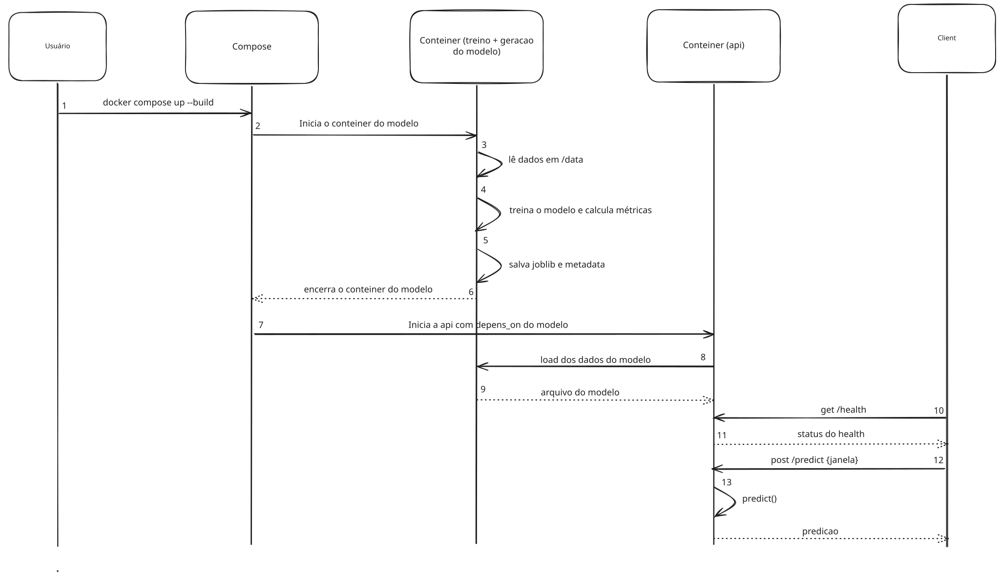
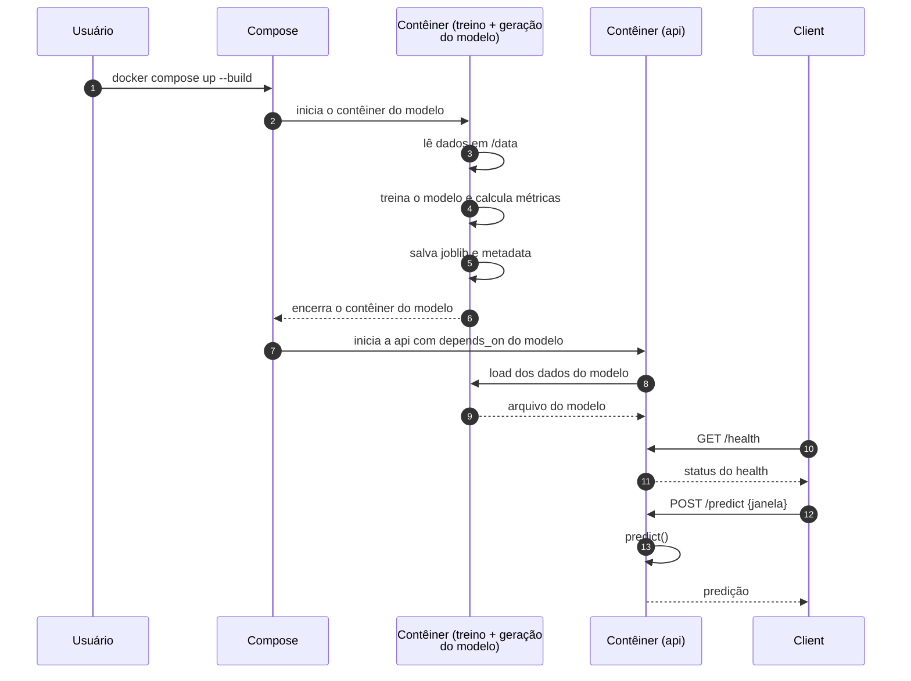
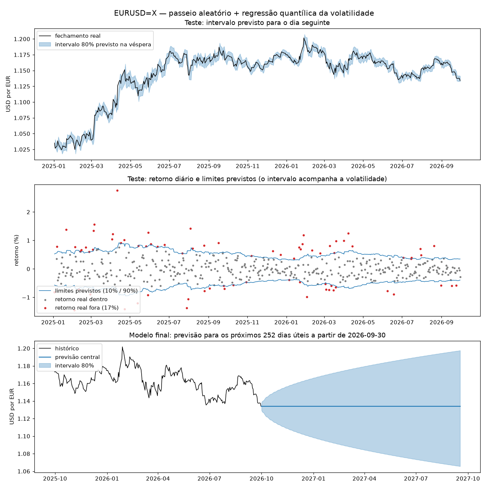

# modelo-de-predição-com-Docker
Ponderada de programação Inteli M7-2026-EC

## Arquitetura do projeto

Antes de iniciar o desenvolvimento, eu desenhei um diagrama UML de sequência no excalidraw e depois pedi para o claude gerar um código em mermaid desse diagrama para representar a arquitetura do projeto e o fluxo de dados entre os componentes. A seguir, apresento o diagrama UML na versão excalidraw e a versão em mermaid:





## Extração dos dados do yfinance

### Moeda escolhida: EURUSD=X

Dentro de `src/gerar-dados.py`, eu criei um código que extrai os dados do yfinance para a moeda escolhida (EURUSD=X) e salva em um arquivo CSV. O código utiliza a biblioteca `yfinance` para baixar o histórico diário da moeda e salva esses dados em `data/dados_eurusd.csv`.

Na primeira versão eu baixei só dois anos de dados (2024 para treino e 2025 para teste). Depois de trocar o modelo (ver abaixo), mudei o período para **01/01/2010 a 30/09/2026**. Com mais histórico, o modelo vê vários períodos de calmaria e de turbulência no câmbio (crise do euro, pandemia, 2022). As datas ficam fixas no código para o resultado ser reproduzível.

## Criação do modelo de predição

Dentro de `src/modelo`, com a ajuda do claude, criei o código que lê o CSV, treina o modelo, avalia e salva o modelo treinado em `models/`.

### Primeira versão: Prophet (descartada)

Comecei com o `prophet`, treinando em 2024 e testando em 2025. No teste de um ano ele teve MAPE de 6,5%, contra 7,9% de simplesmente repetir o último valor de 2024. Mas olhando o gráfico, a vitória foi sorte: a linha prevista apontava para baixo, e o euro subiu em 2025. Quando testei do jeito que a API vai usar o modelo, prevendo o dia seguinte, o Prophet errou cerca de 9 vezes mais do que repetir o fechamento de ontem. Além disso, o intervalo de 80% dele continha o valor real em só 9% dos dias.

### Comparação de alternativas

Com o histórico maior, comparei a previsão do fechamento do dia seguinte de janeiro de 2025 a setembro de 2026:

| Modelo | MAE em relação a repetir o último fechamento |
|---|---|
| Repetir o último fechamento | 1,00 |
| Ridge sobre os retornos dos últimos dias | 1,00 (a regularização zerou os coeficientes) |
| Gradient boosting | 1,01 |
| Prophet re-treinado a cada 5 dias | 3,24 |

### Modelo final

- **Previsão central:** o último fechamento conhecido (passeio aleatório).
- **Intervalo de 80%:** uma regressão quantílica (`QuantileRegressor` do scikit-learn) prevê os quantis de 10% e 90% do retorno do dia seguinte a partir da volatilidade dos últimos 5, 20 e 60 dias. Para h dias úteis à frente, o intervalo é multiplicado por √h.

Usei um split cronológico, sem embaralhar: treino até 2023, validação em 2024 e teste de janeiro de 2025 a setembro de 2026. Na validação, a regressão quantílica empatou com uma EWMA e ganhou do intervalo fixo e do gradient boosting. Escolhi a regressão quantílica por ser um modelo treinado e exportável. Depois da avaliação, o modelo é treinado de novo com o histórico inteiro.

### Resultados no teste (jan/2025 a set/2026)

| Horizonte | Cobertura (alvo 80%) | Largura média | Pinball | Baseline: cobertura | Baseline: largura | Baseline: pinball |
|---|---|---|---|---|---|---|
| 1 dia | 82,9% | 1,11% | 7,89 | 86,7% | 1,25% | 8,37 |
| 5 dias | 83,9% | 2,48% | 17,57 | 87,9% | 2,78% | 18,10 |
| 21 dias | 82,1% | 5,14% | 33,73 | 85,8% | 5,64% | 35,44 |
| 63 dias | 83,0% | 9,18% | 68,76 | 81,7% | 9,89% | 75,22 |

O intervalo do modelo cobre perto dos 80% prometidos e é mais estreito que o baseline em todos os horizontes. No gráfico do meio, dá para ver o intervalo alargar nos meses agitados (março a maio de 2025) e estreitar quando o mercado acalma.



## Criação da API

Criei uma API simples com FastAPI, que lê o modelo treinado e responde a requisições de predição. A API tem dois endpoints:

- `GET /health`: retorna o status da API.
- `POST /predict`: recebe um JSON com a janela de dias úteis à frente e retorna a predição do fechamento do euro e o intervalo de 80%.

## deploy com Docker Compose

Antes de eu fazer o deploy no compose em si eu escrevi os 2 dockerfile dos 2 contêineres (modelo e api) e testei cada um separadamente. Depois criei o `docker-compose.yml` para juntar os dois contêineres. O contêiner do modelo é iniciado primeiro, treina o modelo e salva os arquivos necessários. Em seguida, o contêiner da API é iniciado, que carrega o modelo treinado e fica pronto para receber requisições.

## Erro da geração de dados do yfinance

Antes de finalizar a ponderada, fui rodar tudo do zero e o yfinance deu erro e estava retornando um dataframe vazio, então implementei uma lógica de retry para evitar erros de conexão. O código agora tenta baixar os dados 5 vezes, com 5 segundos de espera entre cada tentativa. Se ainda assim não conseguir, ele levanta uma exceção. Deixei um arquivo de backup dos dados para evitar problema

## Como rodar o projeto

### Teste local para dev

Gerar os dados do yfinance:

```bash
python src/gerar-dados.py
```

Treinar o modelo:

```bash
python src/modelo/treinar-modelo.py
```

Rodar a API:

```bash
cd backend && uvicorn app.main:app
```

### Rodar com Docker Compose

```bash
python src/gerar-dados.py
```

Depois que tiver os dados:

```bash
docker compose up --build
```

Testar rotas

```bash
# health
curl http://localhost:8000/health

# predict
curl -X POST http://localhost:8000/predict -H 'Content-Type: application/json' -d '{"janela": 5}'
```